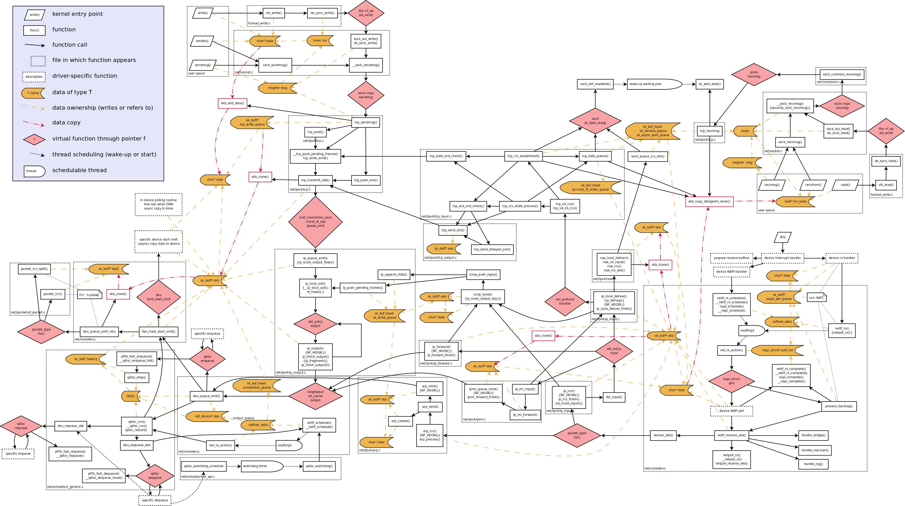

# Links

Literatures I have or haven't read.

* [Tuning Linux TCP for data-center networks](https://lpc.events/event/16/contributions/1343/attachments/1027/1972/Tuning%20Linux%20TCP%20for%20data-center%20networks%20%283%29.pdf) by Yuchung Cheng,
  Linux Plumbers 2022.
* [Socksdirect: datacenter sockets can be fast and compatible](https://dlnext.acm.org/doi/abs/10.1145/3341302.3342071), SIGCOMM '19. [PDF](https://www.microsoft.com/en-us/research/uploads/prod/2019/08/p90-li.pdf)
* [Busypolling next generation](https://netdevconf.info/2.1/session.html?dumazet) by Eric Dumazet, 2017.
* [Making Linux TCP Fast](https://netdevconf.info/1.2/session.html?yuchung-cheng) by Yuchung Cheng and Neal Cardwell, 2016.
  [paper](https://netdevconf.info/1.2/papers/bbr-netdev-1.2.new.new.pdf)
* [Kernel Networking Walkthrough](https://www.slideshare.net/ThomasGraf5/linuxcon-2015-linux-kernel-networking-walkthrough) by Thomas Graf (tglx), LinuxCon 2015.
Nice and short (~20 slides) intro to NAPI, RSS, RPS, GRO, TSO, FastOpen with pictures.
Next year: [Kernel Networking Explained](https://www.slideshare.net/ThomasGraf5/linux-networking-explained) by Thomas Graf, LinuxCon 2016, 27 slides.
* [Linux Networking Architecture](https://www.slideshare.net/hugolu/the-linux-networking-architecture/63) slides by Hugo Lu, 2014.
* [Queueing in the Linux Network Stack](https://www.coverfire.com/articles/queueing-in-the-linux-network-stack/), 2013.
* [TCP small queues](https://lwn.net/Articles/507065/), LWN 2012.
* [Controlling Queue Delay](https://queue.acm.org/detail.cfm?id=2209336) by Kathleen Nichols and Van Jacobson, ACM Queue May 2012.
* [The classification and evolution of variants of TCP congestion control](https://www.researchgate.net/figure/The-classification-and-evolution-of-variants-of-TCP-congestion-control-Afanasyev-et-al_fig1_262053709)
* [EECS 489: Computer Networks at umich.edu](https://www.eecs.umich.edu/courses/eecs489/w10/syllabus.html)
* [You don't know jack about Network Performance](https://queue.acm.org/detail.cfm?id=1066069) by Kevin Fall and Steve McCanne, ACM Queue June 2005.  Clearly explains four types of [network delay](https://en.wikipedia.org/wiki/Network_delay).
* [TCP Implementation in Linux: A Brief Tutorial](http://www.ece.virginia.edu/mv/research/DOE09/publications/TCPlinux.pdf), 2008. Nice two-page overview of TCP/IP stack in Linux 2.6.19.
* [Scaling in the Linux Networking Stack](https://www.kernel.org/doc/Documentation/networking/scaling.txt), kernel doc that describes RSS, RPS, RFS, XPS, etc.
* [Segmentation Offloads in the Linux Networking Stack](https://www.kernel.org/doc/Documentation/networking/segmentation-offloads.txt), about TSO, GSO, GRO, etc.
* [Programming with the Netpoll API](http://people.redhat.com/~jmoyer/netpoll-linux_kongress-2005.pdf) by Jeff Moyer, Linux Kongress 2005.
* [Kernel data flow of 2.6.20](https://wiki.linuxfoundation.org/networking/kernel_flow) 

## RFCs
* [RFC1958](https://tools.ietf.org/html/rfc1958) Architectural Principles of the Internet, 1996-06.
* [RFC2525](https://tools.ietf.org/html/rfc2525) Known TCP Implementation Problems, 1999-03.
* [RFC2544](https://tools.ietf.org/html/rfc2544) Benchmarking Methodology for Network Interconnect Devices, 1999-03.
* [RFC3439](https://tools.ietf.org/html/rfc3439) Some Internet Architectural Guidelines and Philosophy, 2002-12.
  "Layering Considered Harmful." linked from [Internet protocol suite](https://en.wikipedia.org/wiki/Internet_protocol_suite#Layer_names_and_number_of_layers_in_the_literature)
* [RFC6349](https://www.rfc-editor.org/rfc/rfc6349) Framework for TCP Throughput Testing, 2011-08.
* [RFC8900](https://tools.ietf.org/html/rfc8900) IP Fragmentation Considered Fragile
* [RFC9006](https://tools.ietf.org/html/rfc9006) TCP Usage Guidance in the Internet of Things (IoT), 2021-03.

## RFC drafts
* <https://tools.ietf.org/html/draft-dukkipati-tcpm-tcp-loss-probe-01>, early version of [RFC8985](https://tools.ietf.org/html/rfc8985)?
* <https://tools.ietf.org/html/draft-cardwell-iccrg-bbr-congestion-control-00>

## Posts

* [Segmentation and Checksum Offloading: Turning Off with ethtool](https://sandilands.info/sgordon/segmentation-offloading-with-wireshark-and-ethtool) by Dr Steven Gordon, 2010
* [Reply from David Miller](https://seclists.org/tcpdump/2009/q3/14) about capturing packets when GSO is on.
* <https://calomel.org/network_loss_emulation.html>
* <https://spl0dge.wordpress.com/2013/09/08/building-a-wan-simulator/>
* <https://web.archive.org/web/20160306040049/http://tdistler.com/2011/06/10/netem-wan-emulation-how-to-setup-a-netem-box>
* John Nagle on Nagle's algorithm <https://news.ycombinator.com/item?id=9048947>, 2015.
* [Coping with the TCP TIME-WAIT state on busy Linux servers](https://vincent.bernat.ch/en/blog/2014-tcp-time-wait-state-linux)
* [Harping on ARP](https://lwn.net/Articles/45373/), [Multiple Interfaces on Same Ethernet Broadcast Network](https://www.kernel.org/doc/html/v4.18/networking/e100.html#multiple-interfaces-on-same-ethernet-broadcast-network)
