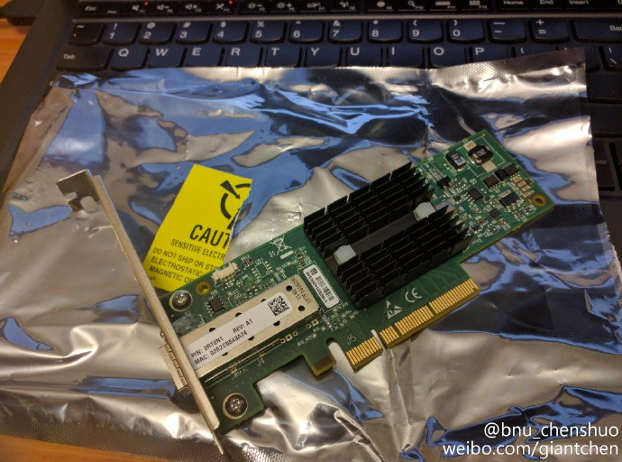
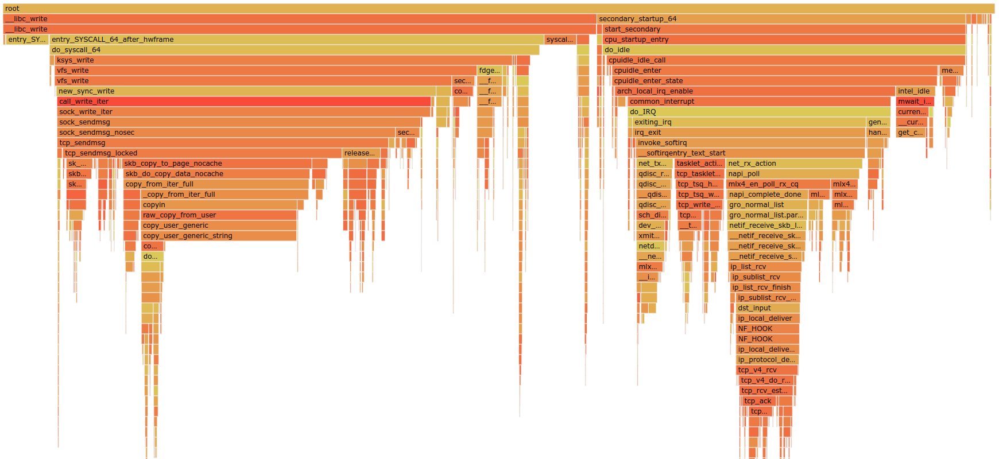
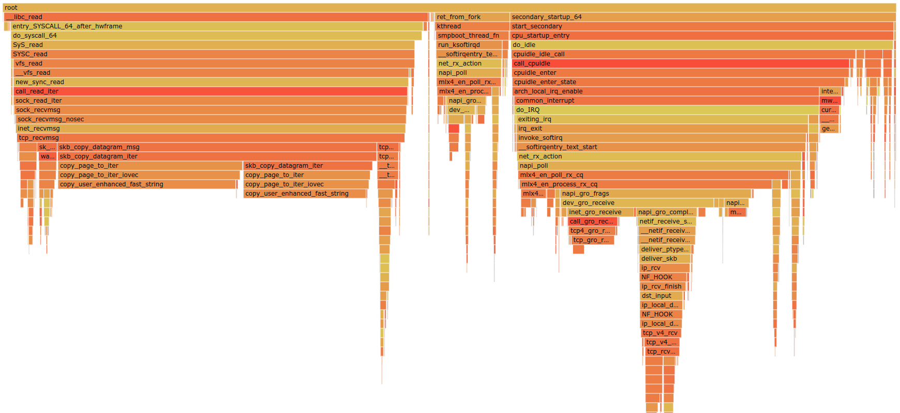

# Profiling Linux TCP/IP stack with perf and pprof

At home, I have two Linux hosts with Mellanox 10GbE nic (bought used from Ebay in 2017),
directly connected using SPF cable.



Thoughput was about 1100MiB/s over 10GbE, both machine runs ~40% CPU utilization in one thread.

For comparison, run `openssl speed sha` on the Rx side machine, an i7-3770 @ 3.4GHz.

```bash
$ openssl speed sha
OpenSSL 1.1.1f  31 Mar 2020
The 'numbers' are in 1000s of bytes per second processed.
type             16 bytes     64 bytes    256 bytes   1024 bytes   8192 bytes  16384 bytes
sha1            137355.08k   323943.17k   603290.54k   770941.95k   843352.75k   849619.63k
sha256           75659.30k   167113.02k   289437.70k   354737.49k   379652.78k   381676.20k
sha512           51745.33k   206941.63k   329443.07k   468301.82k   533897.22k   539525.12k
```

In short, sending data through TCP is faster than calculating SHA1 locally.

## Tx path

Profile taken on Debian bullseye (testing, pre-release 11) w/ kernel 5.6.14.
Run the [chargen](https://github.com/chenshuo/recipes/blob/master/tpc/bin/chargen.cc) program
to keep sending data to a `discard` server.

[](img/profile-chargen.html)

## Rx path

Profile taken on Ubuntu 18.04 w/ kernel 4.15
Run the [discard](https://github.com/chenshuo/recipes/blob/master/tpc/bin/discard.cc) program
to keep reading the socket.

[](img/profile-discard.html)

## Loopback w/ IPv6

Profile taken on Ubuntu 20.04 w/ kernel 5.4.
Run both `chargen` and `discard` on the same i7-3770 host,
throughput was about 3300MiB/s.  `chargen` ran at 100% CPU, `discard` was about 74%.

[](img/profile-loopback6.html)
