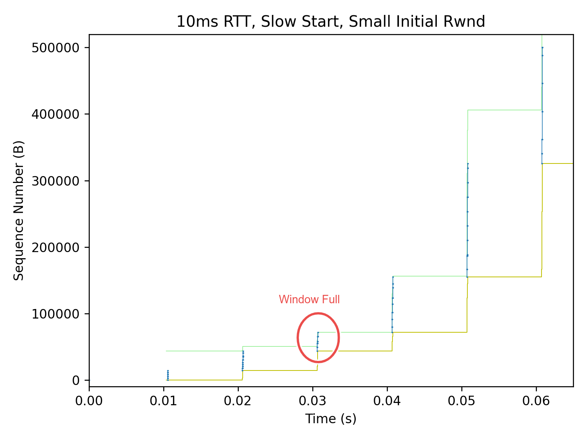
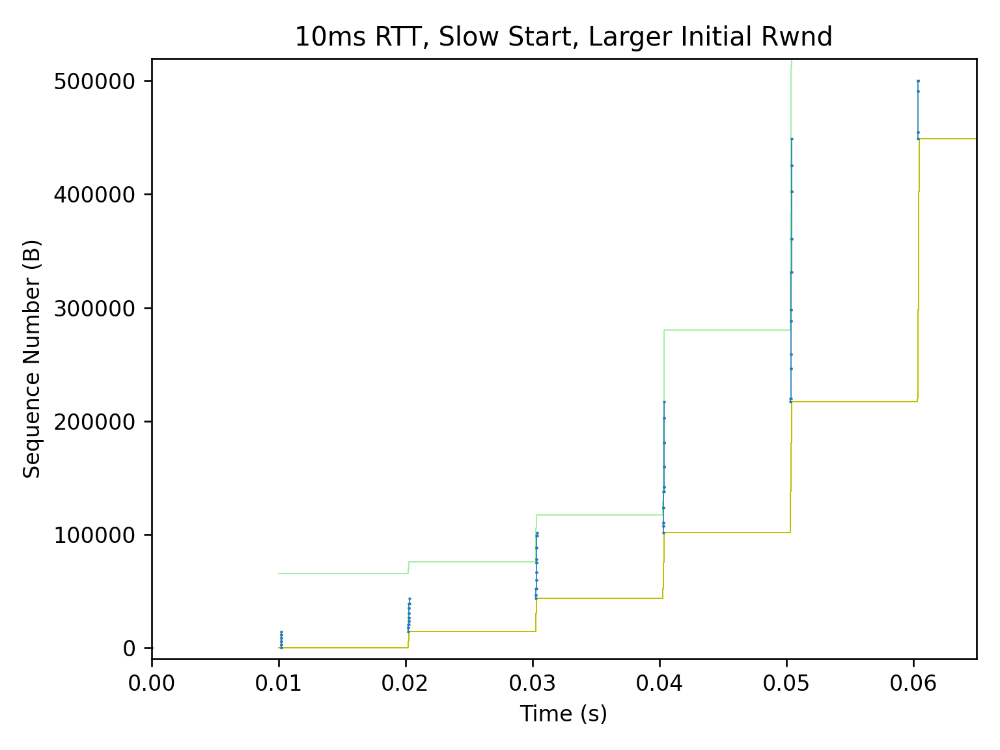
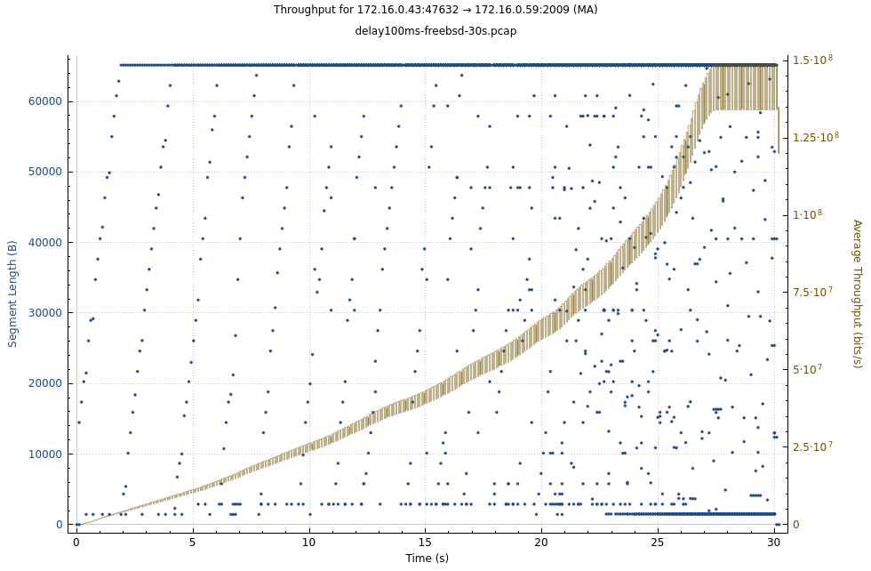

# TCP Slow Start

Standard slow start [RFC5681](https://www.rfc-editor.org/rfc/rfc5681.html#section-3.1):

* Cwnd increases MSS upon receipt of an ACK covering new data of MSS. But Linux and FreeBSD differ when `bytes_acked > 2 * MSS`.
* Effectively Cwnd doubles every round-trip time, Cwnd = IW * 2 ^ nRTT.
* Exits when a packet loss is detected, sets ssthresh to Cwnd/2, as per Reno CC.
* Linux and FreeBSD don't increase Cwnd if transmitting is not limited by Cwnd, see `cubictcp_cong_avoid()` in `tcp_cubic.c` and `tcp_reno_cong_avoid()` in `tcp_cong.c`).

With Initial Window = 10:


## Kernel knobs

```
$ sysctl -A |grep tcp_.mem
                  #  min    default     max
net.ipv4.tcp_rmem = 4096	131072	6291456
net.ipv4.tcp_wmem = 4096	16384	4194304
```

For `tcp_wmem[1] == 16K`, the default `sndbuf` is 16K.
Which is greater than 10 (initial window) * 1460 (typical IPv4 MSS),
works well for slow start.

Linux 4.20 changed `tcp_rmem[1]` from 87k to 128KiB, [commit by Yuchung Cheng in 2018-09](https://git.kernel.org/pub/scm/linux/kernel/git/stable/linux.git/commit/?id=a337531b942bd8a03e7052444d7e36972aac2d92).
So SYN rwin increased from 43k to 65k (when `tcp_adv_win_scale == 1`).

With IW=10 and MSS=1.4k, during slow start,
the old setting will hit window full on 3rd RTT,
limit sent bytes to ~70kB.
In new setting, 1.4 * (10+20+40) ~= 100k can be sent in 3RTT.






From `linux-stable/Documentation/networking/ip-sysctl.rst`:

```
tcp_adv_win_scale - INTEGER
        Count buffering overhead as bytes/2^tcp_adv_win_scale
        (if tcp_adv_win_scale > 0) or bytes-bytes/2^(-tcp_adv_win_scale),
        if it is <= 0.  Default: 1
```

In other words,

| `tcp_adv_win_scale` | Advertised window ratio | Max adv win when `tcp_rmem[2] == 8M` |
| ------------------  | ----------------------- | --- |
| 0                   |  100% | 8M |
| 1 (default since Linux 3.4) |   50% | 4M |
| 2                   |   75% | 6M |
| 3                   | 87.5% | 7M |
| -1                  | 50%   | 4M |
| -2                  | 25%   | 2M |
| -3                  | 12.5% | 1M |

This value was changed in Linux 3.4 from 2 to 1.
Here's a brief history:

| Kernel Version | `tcp_adv_win_scale` | sysctl `tcp_rmem[]` | Initial advertised rcvwnd | Max rcvwnd | commit |
| --- | --- | --- | --- | --- | --- |
| Before 3.4 | 2 | "4096 87380 4MiB" | 65535 = (87380 * 0.75) | 3MiB = (4MiB * 0.75) | |
| 3.4 to 4.19 | 1 | "4096 87380 6MiB" | 43800 = (87380 * 0.5) | 3MiB = (6MiB * 0.5) | [2012-05](https://git.kernel.org/pub/scm/linux/kernel/git/stable/linux.git/commit/?id=b49960a05e32121d29316cfdf653894b88ac9190) |
| Since 4.20 | 1 | "4096 128KiB 6MiB" | 64Ki = (128Ki * 0.5) | 3MiB = (6MiB * 0.5) | [2018-09](https://git.kernel.org/pub/scm/linux/kernel/git/stable/linux.git/commit/?id=a337531b942bd8a03e7052444d7e36972aac2d92)|

## HyStart++

Stardard slow start ends when a packet loss is detected, but this often causes overshoot.

_HyStart++ uses "increase in round-trip delay" as a heuristic to find an exit point before possible overshoot._

* [RFC9406](https://tools.ietf.org/html/rfc9406) HyStart++: Modified Slow Start for TCP, 2023-05.
* Linux incorporated HyStart++ to CUBIC in v2.6.29, 2009. [commit by Sangtae Ha](https://git.kernel.org/pub/scm/linux/kernel/git/stable/linux.git/commit/?id=ae27e98a51526595837ab7498b23d6478a198960).
* FreeBSD adds HyStart++ to its newreno CC <https://reviews.freebsd.org/D32373> in 2021, but not released as of 13.2.
FreeBSD will switch to CUBIC (in release 14?).
* <https://blog.cloudflare.com/cubic-and-hystart-support-in-quiche/>

## FreeBSD

As noticed in [Low throughput due to small cwnd](throughput.md#small-cwnd),
FreeBSD slow-start is sometimes much slower than Linux,
and underutilizes the bandwidth of a link with long delay (say 50ms ~ 100ms).



As I analyzed in <https://lists.freebsd.org/archives/freebsd-net/2023-May/003282.html>,
it's due to bad interaction with LRO and delayed-ACKs of receiver side.

RFC 5681 states that

```text
During slow start, a TCP increments cwnd by at most SMSS bytes for
each ACK received that cumulatively acknowledges new data.  While
traditionally TCP implementations have increased cwnd by precisely
SMSS bytes upon receipt of an ACK covering new data, we RECOMMEND
that TCP implementations increase cwnd, per:

    cwnd += min (N, SMSS)

where N is the number of previously unacknowledged bytes acknowledged
in the incoming ACK.
```

If one ACK is generated per SMSS, the `cwnd` grows exponentially.
In old times,

```
RTT1: cwnd = 1, send 1 MSS
RTT2: got 1st ACK, cwnd = 2, send 2 MSS
RTT3: got 2nd ACK, cwnd = 3, send 2 MSS
      got 3rd ACK, cwnd = 4, send 2 MSS
RTT4: got 4 ACKs,  cwnd = 8, send 8 MSS
RTT5: got 8 ACKs, cwnd = 16, send 16 MSS
```

RFC 5681 also requires that

> A receiver SHOULD generate an ACK for **at least every second full-sized segment.**

If receiver follows this, the slow-start should work just fine.

But in case of LRO and TSO, the sender sees much less ACKs than the old days.

Really slow start:

```
RTT1: cwnd = 10, send segment of 10 MSS with TSO
RTT2: got 1st ACK (LRO in receiver), cwnd = 12, send 12 MSS with TSO
RTT3: got 2nd ACK, cwnd = 14, send 14 MSS with TSO
RTT4: got 3rd ACK, cwnd = 16, send 16 MSS with TSO
RTT5: got 4th ACK, cwnd = 18, send 18 MSS with TSO
```

So `cwnd` grows more-or-less linearly until it reaches max TSO segments (65k / 1.4k =~ 45).
I intuitively guess `cwnd` grows quadratically after that,
i.e. two segments/ACKs per RTT, then three segments/ACKs per RTT, and so on.

FreeBSD 13.x TCP sender closely follows RFC 5681 with RFC 3465 extension,
It also addressed the LRO of the sender side (multiple ACKs being aggregated into one).
`sys/netinet/cc/cc_newreno.c`

```c
static void
newreno_ack_received(struct cc_var *ccv, uint16_t type)
{
    // ...
                /*
                 * Regular in-order ACK, open the congestion window.
                 * Method depends on which congestion control state we're
                 * in (slow start or cong avoid) and if ABC (RFC 3465) is
                 * enabled.
                 *
                 * slow start: cwnd <= ssthresh
                 * cong avoid: cwnd > ssthresh
                 *
                 * slow start and ABC (RFC 3465):
                 *   Grow cwnd exponentially by the amount of data
                 *   ACKed capping the max increment per ACK to
                 *   (abc_l_var * maxseg) bytes.
                 *
                 * slow start without ABC (RFC 5681):
                 *   Grow cwnd exponentially by maxseg per ACK.
                 *
                 * ...
                 */

                // In slow-start
                if (V_tcp_do_rfc3465) {
                        uint16_t abc_val;

                        if (ccv->flags & CCF_USE_LOCAL_ABC)
                                abc_val = ccv->labc;
                        else
                                abc_val = V_tcp_abc_l_var;  // sysctl value, default = 2

                        // abc_val is 1 by default
                        // ccv->nsegs is number of ACKs being aggregated due to LRO

                        if (CCV(ccv, snd_nxt) == CCV(ccv, snd_max))
                                incr = min(ccv->bytes_this_ack,
                                    ccv->nsegs * abc_val *
                                    CCV(ccv, t_maxseg));
                        else
                                incr = min(ccv->bytes_this_ack, CCV(ccv, t_maxseg));
                }

                // incr == 2*1448 = 2896 in normal start start case
```

As discussed in sec3.2 of RFC 3465, L=2*SMSS bytes exactly balances
the negative impact of the delayed ACK algorithm.

But if the receiver (sink) also does LRO, it won't generate enough ACKs to open cwnd of the sender.
Often we observe that FreeBSD is ``slower`` when sending data using TCP, comparing to Linux or even Windows.
<https://lists.freebsd.org/archives/freebsd-hackers/2023-April/002082.html>

As suggested in <https://calomel.org/freebsd_network_tuning.html>,
a large `abc_l_var` should help in this situation.

```
# TCP Slow start gradually increases the data send rate until the TCP
# congestion algorithm (CDG, H-TCP) calculates the networks maximum carrying
# capacity without dropping packets. TCP Congestion Control with Appropriate
# Byte Counting (ABC) allows our server to increase the maximum congestion
# window exponentially by the amount of data ACKed, but limits the maximum
# increment per ACK to (abc_l_var * maxseg) bytes. An abc_l_var of 44 times a
# maxseg of 1460 bytes would allow slow start to increase the congestion window
# by more than 64 kilobytes per step; 65535 bytes is the TCP receive buffer
# size of most hosts without TCP window scaling.
#
net.inet.tcp.abc_l_var=44   # (default 2) if net.inet.tcp.mssdflt = 1460
```

### Traces

When `h_ertt` is on, it will momentarily disable TSO whilst marking a
packet to use for a new RTT measurement, resulting in more segments being sent,
and more ACK received (from Linux), then cwnd could increase faster.

Linux enters 'quickack' mode right after connection establishment,
disabling delayed-ACKing for a while, to help peer measuring RTT and accelerate slow-start.
But FreeBSD won't, it always delays ACKing (IIUC).

```
// linux-stable/include/net/tcp.h

/* Maximal number of ACKs sent quickly to accelerate slow-start. */
#define TCP_MAX_QUICKACKS       16U
```

```
// linux-stable/net/ipv4/tcp_input.c

static void tcp_event_data_recv(struct sock *sk, struct sk_buff *skb)
{
        // ...

        if (!icsk->icsk_ack.ato) {
                  /* The _first_ data packet received, initialize
                   * delayed ACK engine.
                   */
                  tcp_incr_quickack(sk, TCP_MAX_QUICKACKS);
                  icsk->icsk_ack.ato = TCP_ATO_MIN;

```

* FreeBSD 13 sender, Linux receiver

    Really slow start on a 100ms link:

```c
 0.000000 IP freebsd13 > linux: Flags [S], seq 205083268, win 65535, options [mss 1460,nop,wscale 10,sackOK,TS val 495212525 ecr 0], len 0
 0.100786 IP linux > freebsd13: Flags [S.], seq 708257395, ack 205083269, win 65160, options [mss 1460,sackOK,TS val 563185696 ecr 495212525,nop,wscale 7], len 0
 0.100800 IP freebsd13 > linux: Flags [.], ack 1, win 65, options [nop,nop,TS val 495212626 ecr 563185696], len 0

 // cwnd = 10
 0.101062 IP freebsd13 > linux: Flags [.], seq 1:14481, ack 1, win 65, len 14480
 0.201241 IP linux > freebsd13: Flags [.], ack 14481, win 427, len 0

 // cwnd = 12
 0.201253 IP freebsd13 > linux: Flags [.], seq 14481:31857, ack 1, win 65, len 17376
 0.301621 IP linux > freebsd13: Flags [.], ack 31857, win 411, len 0

 // cwnd = 14
 0.301630 IP freebsd13 > linux: Flags [.], seq 31857:52129, ack 1, win 65, len 20272
 0.402010 IP linux > freebsd13: Flags [.], ack 52129, win 395, len 0

 // cwnd = 16
 0.402018 IP freebsd13 > linux: Flags [P.], seq 52129:73629, ack 1, win 65, len 21500
 0.402026 IP freebsd13 > linux: Flags [.], seq 73629:75077, ack 1, win 65, len 1448
 0.502392 IP linux > freebsd13: Flags [.], ack 75077, win 860, len 0

 // cwnd = 18
 0.502398 IP freebsd13 > linux: Flags [.], seq 75077:101141, ack 1, win 65, len 26064
 0.602775 IP linux > freebsd13: Flags [.], ack 101141, win 1267, len 0

 // cwnd = 20
 0.602783 IP freebsd13 > linux: Flags [.], seq 101141:130101, ack 1, win 65, len 28960
 0.703169 IP linux > freebsd13: Flags [.], ack 130101, win 1719, len 0

 // cwnd = 22
 0.703177 IP freebsd13 > linux: Flags [P.], seq 130101:159297, ack 1, win 65, len 29196
 0.703185 IP freebsd13 > linux: Flags [.], seq 159297:160745, ack 1, win 65, len 1448
 0.803367 IP linux > freebsd13: Flags [.], ack 160745, win 2198, len 0

 // cwnd = 24
 0.803375 IP freebsd13 > linux: Flags [.], seq 160745:195497, ack 1, win 65, len 34752
 0.903754 IP linux > freebsd13: Flags [.], ack 195497, win 2741, len 0

 // cwnd = 26
 0.903762 IP freebsd13 > linux: Flags [.], seq 195497:233145, ack 1, win 65, len 37648
```

* FreeBSD 14 sender, Linux receiver

    Faster than 13, because `h_ertt` is on by default.

```c
 0.000000 IP freebsd14 > linux: Flags [S], seq 3748224575, win 65535, options [mss 1460,nop,wscale 6,sackOK,TS val 790917200 ecr 0], len 0
 0.100788 IP linux > freebsd14: Flags [S.], seq 489912744, ack 3748224576, win 65160, options [mss 1460,sackOK,TS val 380822116 ecr 790917200,nop,wscale 7], len 0
 0.100851 IP freebsd14 > linux: Flags [.], ack 1, win 1027, options [nop,nop,TS val 790917303 ecr 380822116], len 0

 // cwnd = 10
 0.114635 IP freebsd14 > linux: Flags [.], seq 1:14481, ack 1, win 1027, len 14480
 0.215265 IP linux > freebsd14: Flags [.], ack 14481, win 445, len 0

 // cwnd = 12, h_ertt is on, send two segments, 1 MSS + 11 MSS
 0.215334 IP freebsd14 > linux: Flags [.], seq 14481:15929, ack 1, win 1027, len 1448
 0.215363 IP freebsd14 > linux: Flags [.], seq 15929:31857, ack 1, win 1027, len 15928

 // got ACK for 1 MSS, cwnd = 13, send 2 segments
 0.316142 IP linux > freebsd14: Flags [.], ack 15929, win 501, len 0
 0.316210 IP freebsd14 > linux: Flags [.], seq 31857:33305, ack 1, win 1027, len 1448
 0.316240 IP freebsd14 > linux: Flags [.], seq 33305:34753, ack 1, win 1027, len 1448

 // got ACK for 11 MSS, cwnd = 15, send 1 segment of 13 MSS
 0.316248 IP linux > freebsd14: Flags [.], ack 31857, win 440, len 0
 0.316279 IP freebsd14 > linux: Flags [.], seq 34753:53577, ack 1, win 1027, len 18824

 // got ACK for 1 MSS, cwnd = 16, send 2 segments
 0.416970 IP linux > freebsd14: Flags [.], ack 33305, win 524, len 0
 0.417047 IP freebsd14 > linux: Flags [.], seq 53577:55025, ack 1, win 1027, len 1448
 0.417077 IP freebsd14 > linux: Flags [.], seq 55025:56473, ack 1, win 1027, len 1448

 // got ACK for 1 MSS, cwnd = 17, send 1 segment of 2 MSS
 0.417085 IP linux > freebsd14: Flags [.], ack 34753, win 546, len 0
 0.417103 IP freebsd14 > linux: Flags [.], seq 56473:59369, ack 1, win 1027, len 2896

 // got ACK for 13 MSS, cwnd = 19, send 1 segment of 15 MSS
 0.417111 IP linux > freebsd14: Flags [.], ack 53577, win 840, len 0
 0.417146 IP freebsd14 > linux: Flags [.], seq 59369:81089, ack 1, win 1027, len 21720

 // And so on
 0.517759 IP linux > freebsd14: Flags [.], ack 55025, win 863, len 0
 0.517833 IP freebsd14 > linux: Flags [.], seq 81089:82537, ack 1, win 1027, len 1448
 0.517862 IP freebsd14 > linux: Flags [.], seq 82537:83985, ack 1, win 1027, len 1448
```

* FreeBSD 13 sender with `h_ertt` on, same as FreeBSD 14 above

* FreeBSD 14 sender, FreeBSD receiver

    Not as fast as Linux reciever, because the receiver delays ACKs.


